# FIT.AI — Plataforma de Treinos (.NET 10)


> **FIT.AI** é o nome que a pessoa lê — telas, logo, Figma. A solution se chama **`FitAi`**.
>
> Esta branch reescreve em .NET 10 o antigo back-end Node.js (Fastify + Prisma + Better-Auth) e adiciona o front-end web, a área administrativa e o app Android. Veja o [estado atual](#estado-atual).

## 📋 Introdução

Entre com o Google e converse com o **Coach AI**: ele pergunta **peso**, **altura**, **idade** e **% de gordura**, depois o **objetivo**, os **dias disponíveis** e as **restrições**, e monta um **plano de treino de 7 dias** — com divisão (split), exercícios, séries, repetições, descanso e imagem de capa. No dia a dia, o aluno **inicia** e **conclui** o treino do dia e acompanha a **sequência** (🔥), a **consistência**, os **treinos feitos**, a **taxa de conclusão** e o **tempo total**.

Além do aluno, a plataforma tem **professores** e **administradores**: o professor acompanha os alunos dele e monta ou ajusta os planos de treino pela **área administrativa** (`/admin`).

A solution tem três aplicações:

| Aplicação | Projeto | Para quem |
| --- | --- | --- |
| **Backend** — API REST com controllers | `backend/FitAi.Api` | Consumida pela Web e pelo App |
| **Frontend** — ASP.NET Core MVC com Razor Views | `frontend/FitAi.Web` | Aluno (telas do Figma) e professor/admin (`/admin`) |
| **App** — .NET MAUI | `app/FitAi.App` | Aluno, no Android |

As telas do aluno são: **Login, AI Onboarding, Home, Chat da IA, Treino de Hoje, Plano de Treino, Dia do Plano, Evolução e Perfil.**

### Estado atual

| Etapa | Entrega | Estado |
| --- | --- | --- |
| API | Entidades, EF Core + migration, login Google → JWT, papéis, convites (e-mail e código), rotas do aluno, rotas `/admin`, Coach AI com provedor configurável | ✅ Entregue e testada ponta a ponta com PostgreSQL |
| Web — aluno | Login, onboarding/chat, Home, Plano, Treino do dia (iniciar/concluir), Evolução, Perfil (dados e código de convite) | ✅ Entregue |
| Web — `/admin` | Painel, alunos/professores, detalhe do aluno, editor de planos, convites e códigos, configurações do Coach AI | ✅ Entregue |
| App MAUI (Android) | Login com Google, Home, Plano, Treino do dia, Coach AI, Evolução, Perfil | ✅ Código entregue — compilação validada no alvo `net10.0`; o APK precisa ser gerado com o Android SDK (Visual Studio/Rider) |
| Testes | xUnit: sequência, validação de plano, códigos de convite, prompt do Coach | ✅ 19 testes |

**Ainda não feito:** resposta do Coach em streaming (hoje a resposta chega inteira), refresh token (o JWT dura 7 dias e depois pede login de novo), assinatura ("Plano Básico").

--- | --- | --- |
| Scaffold | Solution `FitAi.slnx`, projetos criados, código Node.js removido | ✅ Entregue |
| Contracts | DTOs compartilhados em `shared/FitAi.Contracts` | ✅ Entregue |
| API | Entidades, EF Core + migrations, autenticação, papéis, convites, use cases, controllers, Coach AI | 🚧 Em andamento |
| Web | Telas do aluno + área `/admin` | ⏳ Pendente |
| App | MAUI Android | ⏳ Pendente |
| Testes | xUnit (sequência, use cases) | ⏳ Pendente |

---

## 👥 Papéis e convites

| Papel | Como obtém | O que faz |
| --- | --- | --- |
| **Admin** | E-mail listado em `Auth:AdminEmails` no `appsettings` (aplicado a cada login) | Tudo: cadastra professores, vê todos os alunos e métricas, configura o Coach AI |
| **Professor** | Convidado por um admin (por e-mail) ou promovido no painel | Vê **só os alunos dele**, monta/edita planos, gera códigos de convite, liga/desliga a criação de planos pela IA por aluno |
| **Aluno** | Padrão ao entrar com o Google | Usa a Web e o App: Coach AI, treinos, evolução, perfil |

O aluno se vincula a um professor de duas formas:

1. **Convite por e-mail** — o professor cadastra o e-mail do aluno; no primeiro login com o Google usando esse e-mail, o aluno já entra vinculado.
2. **Código de convite** — o professor gera um código curto (ex.: `FIT-7K2Q`), com validade e limite de usos opcionais, que pode ser desativado a qualquer momento. O aluno digita o código no onboarding ou no Perfil.

Quem entra sem convite vira aluno sem professor e pode informar um código depois. Os **planos de treino** podem ser montados pelo **professor** (no painel) ou pelo **Coach AI** (no chat); o professor vê e ajusta os planos gerados pela IA.

---

## 🏗️ Arquitetura do Sistema

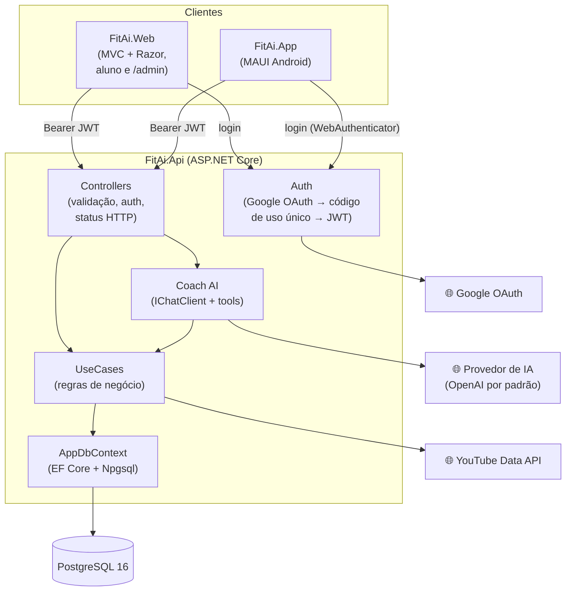

Camadas em uma direção só: **Controllers → Use Cases → EF Core**. O controller valida a entrada e a autenticação, chama um use case e devolve o status HTTP. O use case concentra a regra de negócio, fala direto com o `AppDbContext` e devolve DTOs de `FitAi.Contracts` — nunca a entidade do banco. Erros de negócio são exceções customizadas, traduzidas em `{ error, code }` com o status HTTP correspondente.

### Autenticação

1. O cliente (Web ou App) abre `GET /auth/google/login?redirectUri=...` na API.
2. A API faz o login com o Google e redireciona para `redirectUri?code=...` com um **código de uso único** (curta duração). Só são aceitos os `redirectUri` listados em `Auth:AllowedRedirectUris` (ex.: o callback da Web e `fitai://auth` do App).
3. O cliente troca o código por um **JWT** em `POST /auth/token`.
4. Todas as chamadas seguintes usam `Authorization: Bearer <token>`. O papel e o bloqueio são lidos do banco a cada requisição, então promover ou bloquear alguém vale na hora.

Em desenvolvimento, `POST /auth/dev-login` permite entrar só com um e-mail, sem Google (`Auth:EnableDevLogin`).

### Coach AI com provedor configurável

O chat usa `Microsoft.Extensions.AI` (`IChatClient` + tools). O provedor padrão é a **OpenAI**, mas qualquer provedor listado em `Ai:Providers` pode ser escolhido — pelo `appsettings` ou pelo admin no painel (`/admin`):

| Tipo | Exemplos |
| --- | --- |
| `OpenAI` (endpoint compatível com OpenAI) | OpenAI, Google Gemini, Ollama, OpenRouter, Groq |
| `AzureOpenAI` | Azure OpenAI |

As chaves ficam só na configuração (User Secrets / variáveis de ambiente); no painel o admin escolhe o provedor, o modelo, o prompt do sistema e as imagens de capa. As tools do chat são: `getUserTrainData`, `updateUserTrainData`, `getWorkoutPlans`, `createWorkoutPlan` e `searchExerciseVideos` — sempre com o `userId` do usuário autenticado, nunca vindo do modelo.

### Rotas da API

| Método | Rota | Tela |
| --- | --- | --- |
| `GET` | `/auth/google/login` · `/auth/google/callback` | Login |
| `POST` | `/auth/token` · `/auth/dev-login` | Login |
| `GET` | `/auth/me` | Todas |
| `GET` | `/home/{date}` | Home |
| `GET` · `PUT` | `/me` | Onboarding / Perfil |
| `POST` | `/me/teacher` | Informar código de convite |
| `GET` | `/stats?from=&to=` | Evolução |
| `GET` · `POST` | `/workout-plans` | Plano de Treino |
| `GET` | `/workout-plans/{planId}` | Plano de Treino |
| `GET` | `/workout-plans/{planId}/days/{dayId}` | Treino de Hoje / Dia do Plano |
| `POST` | `/workout-plans/{planId}/days/{dayId}/sessions` | Iniciar treino |
| `PATCH` | `/workout-plans/{planId}/days/{dayId}/sessions/{sessionId}` | Marcar como concluído |
| `POST` | `/coach/chat` | Chat / Onboarding (o cliente reenvia o histórico a cada mensagem) |
| `GET` | `/admin/dashboard` | Painel |
| `GET` · `PATCH` | `/admin/users` · `/admin/users/{id}` | Alunos e professores |
| `POST` · `PUT` · `DELETE` | `/admin/users/{id}/workout-plans` · `/admin/workout-plans/{id}` | Planos dos alunos |
| `GET` · `POST` · `DELETE` | `/admin/invites` · `/admin/invite-codes` | Convites |
| `GET` · `PUT` | `/admin/ai-settings` | Configurações do Coach AI |

### Modelo de dados

Peso em **gramas**, altura em **centímetros**, gordura corporal em **inteiro de 0 a 100**, duração e descanso em **segundos**. Datas com fuso (`timestamptz`). Excluir um plano apaga dias, exercícios e sessões em cascata.

| Tabela | O que armazena |
| --- | --- |
| `Users` | Nome, e-mail, foto, papel, professor, bloqueado, IA pode criar planos, peso, altura, idade, % de gordura |
| `ExternalLogins` | Vínculo com o login do Google |
| `WorkoutPlans` | Aluno, nome, objetivo, capa, ativo (um por aluno), origem (IA ou professor) |
| `WorkoutDays` | Plano, nome, dia da semana, descanso, duração estimada, capa |
| `WorkoutExercises` | Dia, ordem, nome, séries, repetições, descanso |
| `WorkoutSessions` | Dia, início, conclusão (vazia = só iniciada) |
| `EmailInvites` | Convites por e-mail (aluno ou professor) |
| `InviteCodes` | Códigos de convite do professor (validade, limite de usos, ativo) |
| `AuthCodes` | Códigos de uso único do login |
| `AppSettings` | Configurações editáveis no painel (Coach AI) |

---

## 🎯 Sequência e consistência

A **sequência** (🔥) conta, a partir da data pedida para trás, os dias seguidos em que o plano ativo foi cumprido. **Dia de descanso conta** mesmo sem sessão. Dia da semana que não está no plano é pulado. **Hoje não quebra a sequência:** se o treino de hoje já foi concluído, conta; se não, é ignorado. A contagem para no primeiro dia de treino anterior sem sessão concluída, ou na data de criação do plano.

A **consistência** agrupa as sessões pela data de início (UTC). Na **Home**, vem a semana inteira (domingo a sábado); em **Evolução**, só os dias com sessão dentro de `from`–`to`. **Taxa de conclusão** = sessões concluídas ÷ total de sessões. **Tempo total** = soma de (conclusão − início) das sessões concluídas, em segundos. O treino de um dia só pode ser iniciado uma vez **por data** (409), e só em plano ativo (422).

---

## 🚀 Acesso rápido (Docker Desktop)

Com o [Docker Desktop](https://www.docker.com/products/docker-desktop/) aberto, na raiz do repositório:

```bash
docker compose --profile full up -d --build
```

Isso sobe três containers: **PostgreSQL**, **API** e **Web**. A API aplica as migrations e cria os **dados de exemplo** sozinha na primeira subida (leva ~1 minuto por causa do build).

| O quê | Endereço |
| --- | --- |
| Web (aluno) | http://localhost:3000 |
| Área administrativa | http://localhost:3000/admin |
| API + referência interativa (Scalar) | http://localhost:8080/docs |

Na tela de login use o **Login de desenvolvimento** (só o e-mail, sem senha) com um dos usuários de exemplo:

| Usuário | Papel | O que dá para ver |
| --- | --- | --- |
| `admin@fitai.local` | Admin | Painel da plataforma, professores, todos os alunos, configurações do Coach AI (`/admin/ia`) |
| `professor@fitai.local` | Professor (Paulo) | Painel dos alunos dele, editor de planos, convites e o código `FIT-DEMO26` |
| `aluno@fitai.local` | Aluno (Ana) | Plano de treino ativo, ~4 meses de histórico, sequência 🔥 e estatísticas preenchidas |
| `novo.aluno@fitai.local` | Aluno convidado | Primeiro acesso: cai no onboarding já vinculado ao professor (convite por e-mail) |
| qualquer outro e-mail | Aluno sem professor | Onboarding do zero; pode usar o código `FIT-DEMO26` para se vincular ao professor |

**Coach AI:** para o chat responder, crie um arquivo `.env` na raiz (já está no `.gitignore`) antes do `up`:

```bash
OPENAI_API_KEY=sk-...
# opcionais
FITAI_ADMIN_EMAIL=seu-email@gmail.com   # vira Admin
GOOGLE_CLIENT_ID=...                    # login com Google (redirect URI: http://localhost:8080/auth/google/signin)
GOOGLE_CLIENT_SECRET=...
YOUTUBE_API_KEY=...                     # vídeos no chat; sem ela o Coach indica um link de busca
```

Comandos úteis: `docker compose --profile full logs -f api` (logs), `docker compose --profile full down` (parar) e `docker compose --profile full down -v` (parar e **apagar o banco**, recriando os dados de exemplo na próxima subida). Se a porta 5432, 8080 ou 3000 já estiver em uso na sua máquina, pare o serviço que a ocupa ou ajuste o `ports` no `docker-compose.yml`.

> Os usuários de exemplo e o login de desenvolvimento só existem com `ASPNETCORE_ENVIRONMENT=Development` (`Database:SeedDemoData` e `Auth:EnableDevLogin`). Em produção, desligue os dois e use o login com Google.

---

## 🖼️ Telas

Prints gerados com os dados de exemplo. As fotos ficam no próprio projeto (`backend/FitAi.Api/wwwroot/covers`, servidas pela API em `/covers/...`) e vêm do [Free Exercise DB](https://github.com/yuhonas/free-exercise-db), em domínio público — veja os [créditos](backend/FitAi.Api/wwwroot/covers/CREDITS.md). Para usar fotos próprias, substitua os arquivos mantendo os nomes.

**Aluno (Web, layout mobile)**

| Login | Onboarding | Home | Plano de Treino |
| --- | --- | --- | --- |
| 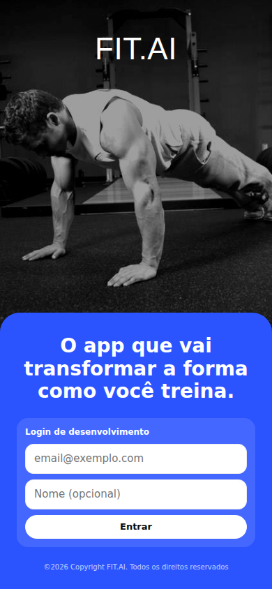 | 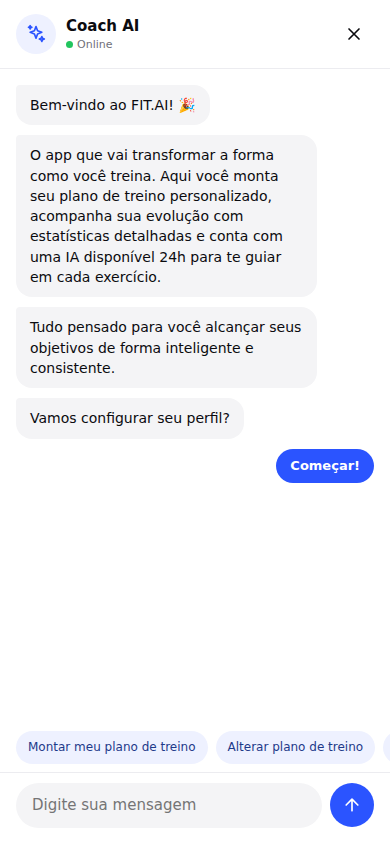 | 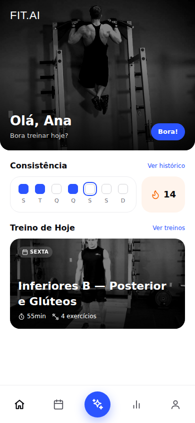 | 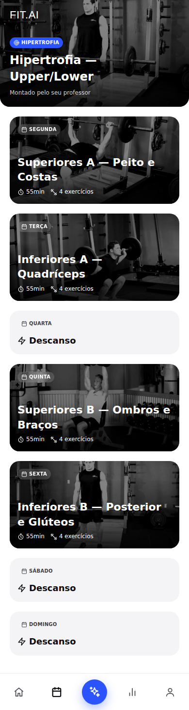 |

| Treino do dia | Coach AI | Evolução | Perfil |
| --- | --- | --- | --- |
| 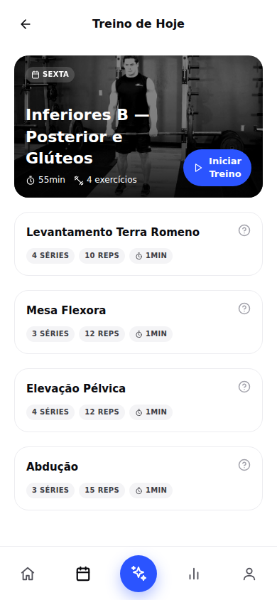 | 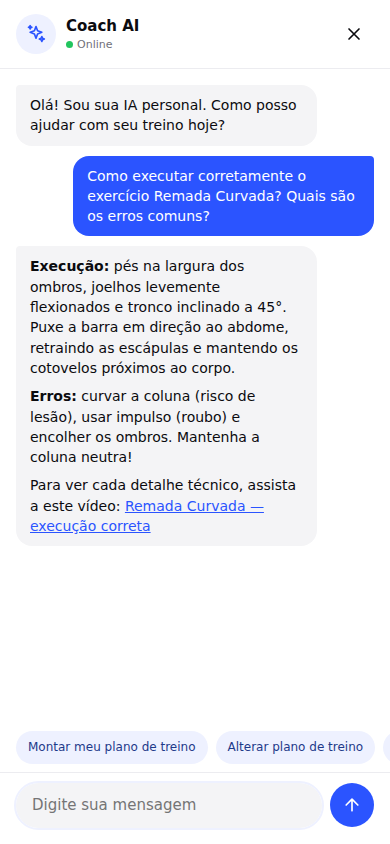 | 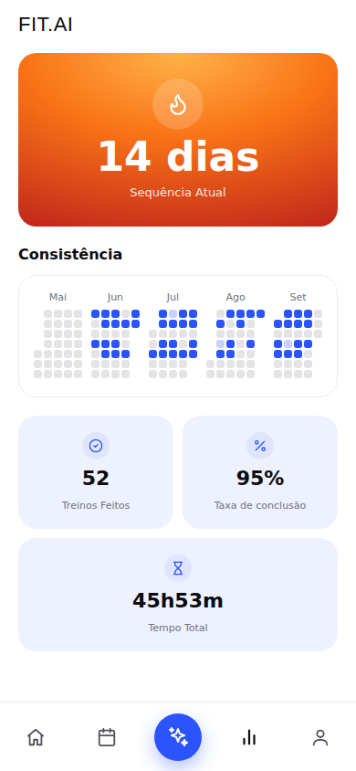 | 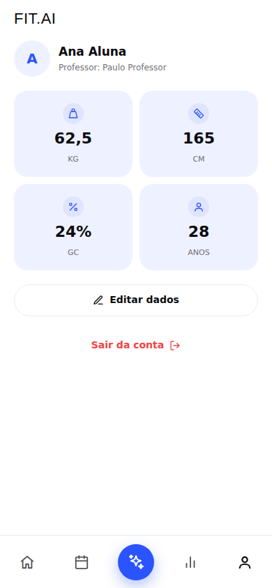 |

**Área administrativa (`/admin`)**

| Painel do professor | Alunos |
| --- | --- |
| 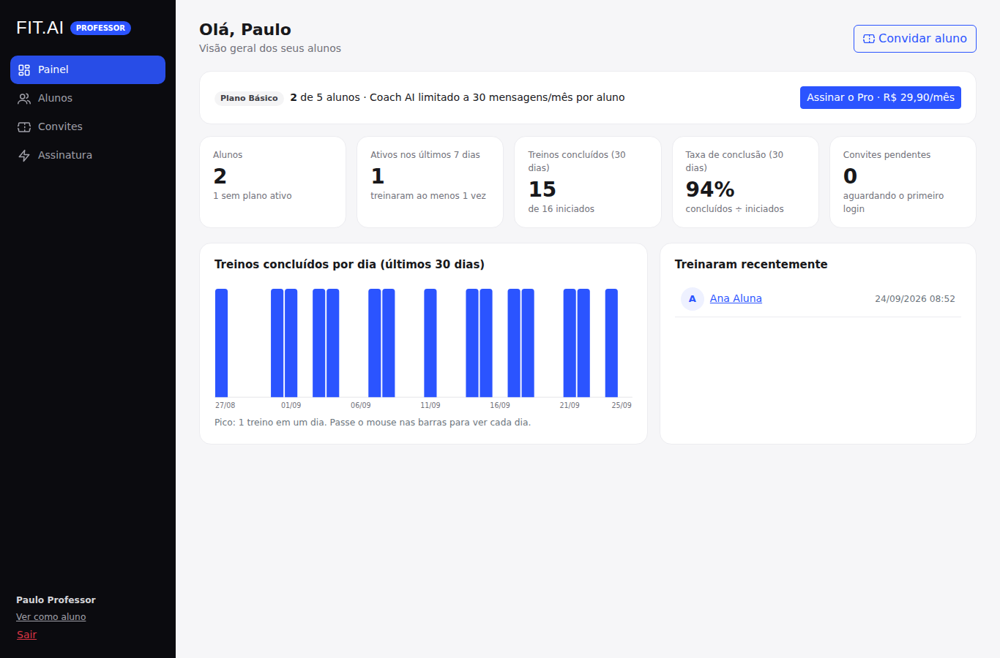 | 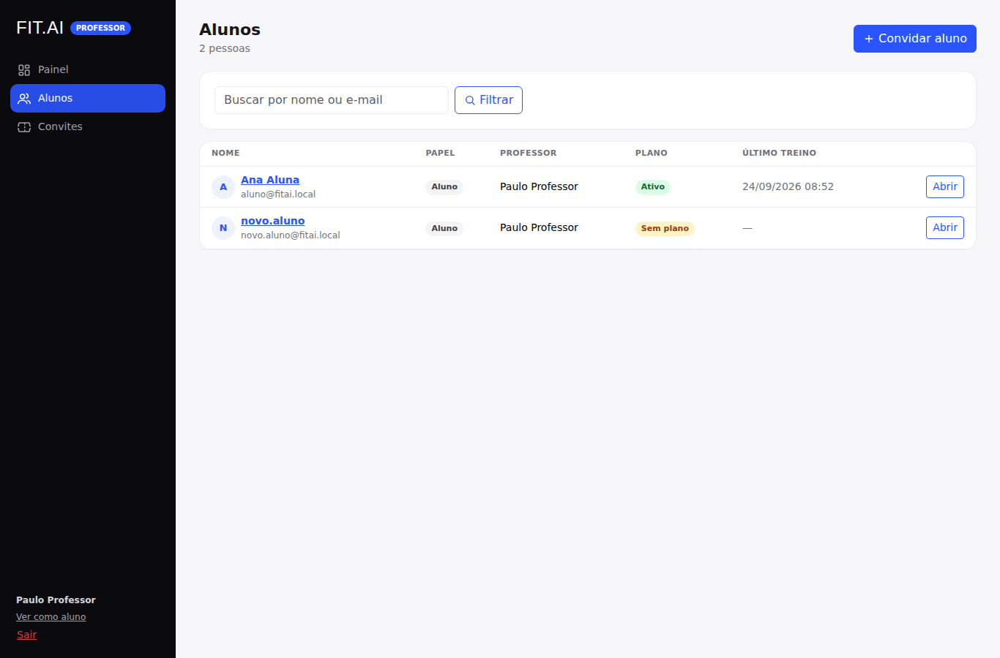 |

| Detalhe do aluno | Editor de plano |
| --- | --- |
| 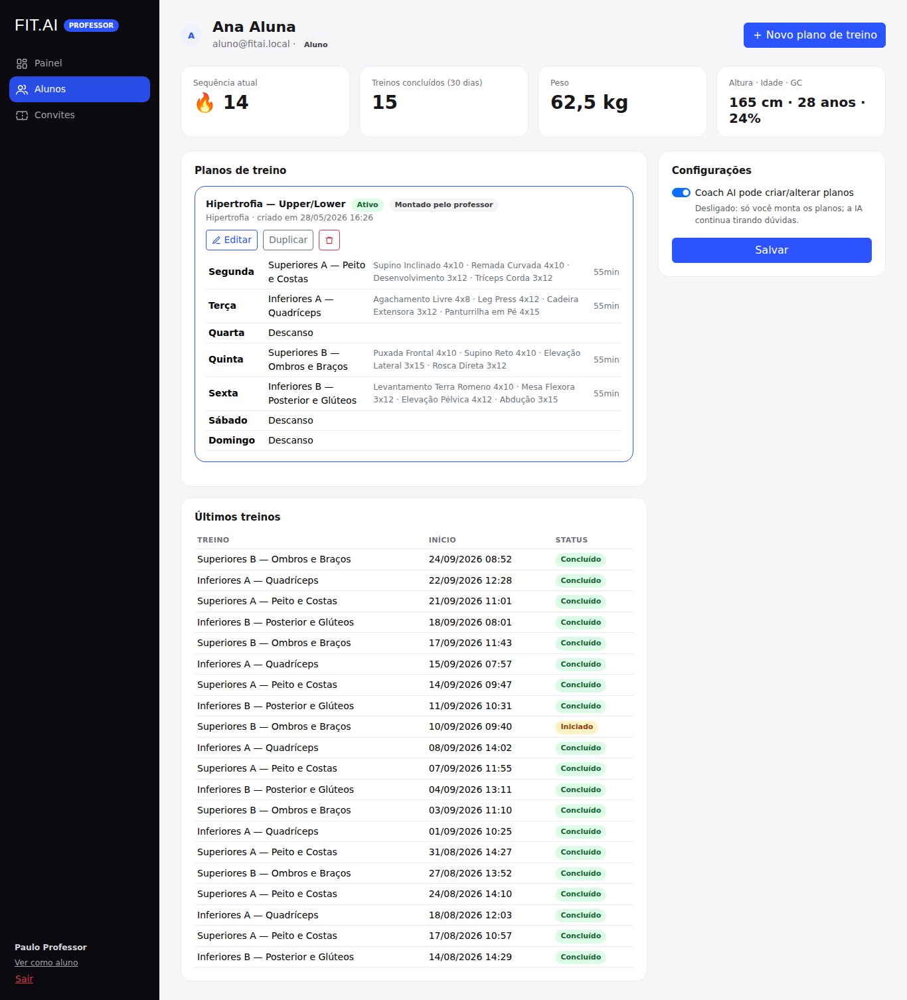 | 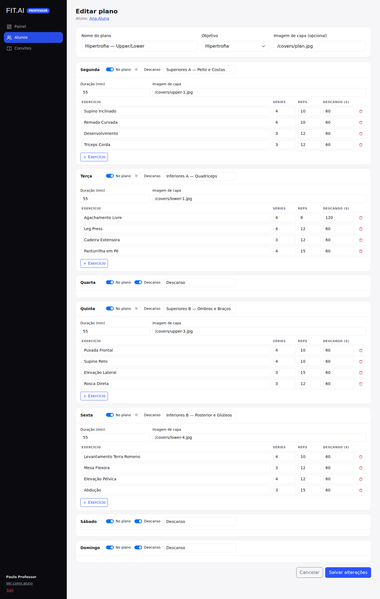 |

| Convites e códigos | Configurações do Coach AI (admin) |
| --- | --- |
| 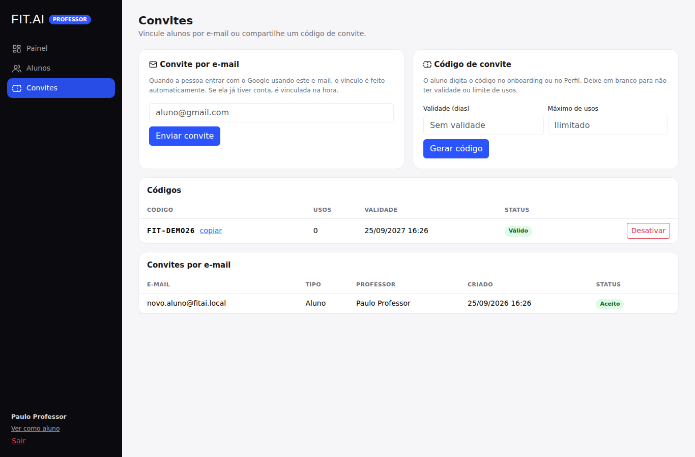 | 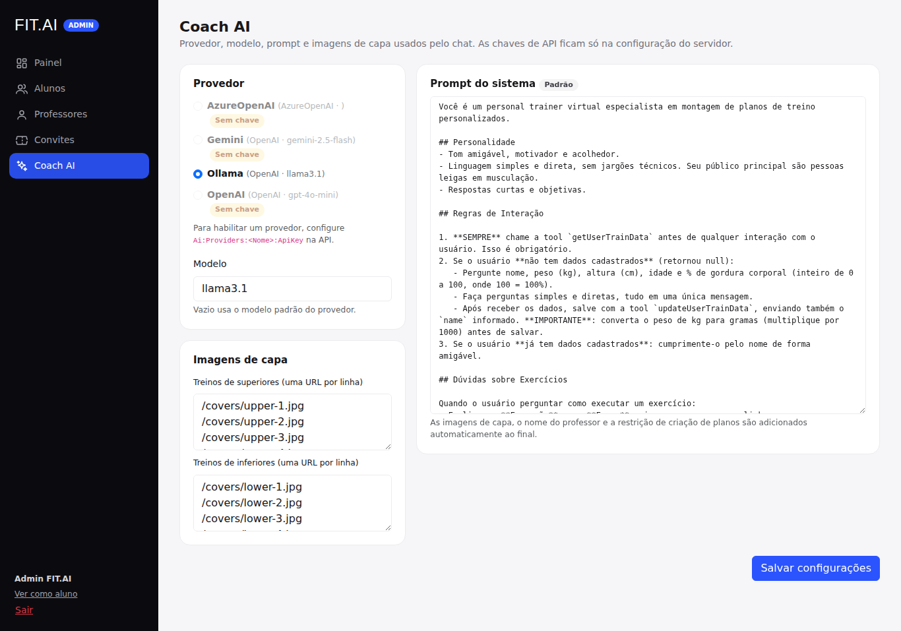 |

---

## ⚙️ Como Executar

### 1. Pré-requisitos

- [.NET 10 SDK](https://dotnet.microsoft.com/download/dotnet/10.0)
- Docker (para o PostgreSQL) ou um PostgreSQL 16 local
- Para o App: workload MAUI (`dotnet workload install maui-android`) e o Android SDK (Visual Studio/Rider já instalam)
- Para criar migrations: `dotnet tool install --global dotnet-ef`

### 2. Banco

```bash
docker compose up -d
```

### 3. Configuração

O `appsettings.Development.json` da API já vem pronto para desenvolvimento local: banco em `localhost:5432`, segredo JWT de desenvolvimento, migrations e [dados de exemplo](#-acesso-rápido-docker-desktop) aplicados no startup e **login de desenvolvimento** (entra só com o e-mail, sem Google).

1. Para o seu e-mail também virar **Admin**, adicione-o em `Auth:AdminEmails` (`backend/FitAi.Api/appsettings.Development.json`).
2. As chaves ficam em [User Secrets](https://learn.microsoft.com/aspnet/core/security/app-secrets), nunca no `appsettings.json`:

```bash
cd backend/FitAi.Api
dotnet user-secrets set "Ai:Providers:OpenAI:ApiKey" "<chave da OpenAI>"
dotnet user-secrets set "Auth:Google:ClientId" "<client id>"          # opcional em dev (há o login de desenvolvimento)
dotnet user-secrets set "Auth:Google:ClientSecret" "<client secret>"
dotnet user-secrets set "YouTube:ApiKey" "<chave do YouTube Data API>" # opcional: sem ela o Coach indica um link de busca
```

No Google Cloud Console, cadastre como *Authorized redirect URI* do OAuth: `http://localhost:8080/auth/google/signin`.

Para trocar de provedor de IA (Gemini, Ollama, Azure OpenAI...), configure a chave em `Ai:Providers:<Nome>:ApiKey` e escolha o provedor no painel (`/admin/ia`) ou em `Ai:DefaultProvider`.

### 4. Rodar

```bash
dotnet run --project backend/FitAi.Api     # API em http://localhost:8080 (referência em /docs)
dotnet run --project frontend/FitAi.Web    # Web em http://localhost:3000 (painel em /admin)
```

Entre com os [usuários de exemplo](#-acesso-rápido-docker-desktop). Ou suba tudo em containers, como descrito no acesso rápido.

**App Android:** abra `app/FitAi.App` no Visual Studio ou Rider (com o workload `maui-android` e o Android SDK) e rode num emulador. O app aponta para `http://10.0.2.2:8080` (o localhost da máquina visto pelo emulador) — para aparelho físico, troque `AppConfig.ApiBaseUrl`. O retorno do login usa o deep link `fitai://auth`, já liberado em `Auth:AllowedRedirectUris`.

### 5. Testes

```bash
dotnet test tests/FitAi.Api.Tests
```

---

## 📂 Estrutura de Pastas

```
FitAi.slnx
├── backend/FitAi.Api/          # API REST (controllers, use cases, EF Core, auth, Coach AI)
├── frontend/FitAi.Web/         # MVC + Razor (telas do aluno e área /admin)
├── app/FitAi.App/              # .NET MAUI (Android)
├── shared/FitAi.Contracts/     # DTOs de request/response e enums compartilhados
├── tests/FitAi.Api.Tests/      # xUnit
├── docker-compose.yml          # PostgreSQL 16
├── docs/                       # prints das telas e template de prompt para novas rotas
└── tasks/                      # especificações originais das funcionalidades
```

---

## 📚 Documentação

- [`CLAUDE.md`](CLAUDE.md) e [`.claude/rules/`](.claude/rules/): convenções do projeto
- [`tasks/`](tasks/): especificação de cada funcionalidade (escritas na versão Node.js; as regras de negócio valem para a versão .NET)
- `/docs` (com a API rodando): referência interativa da API (Scalar)

---

## 📄 Licença e Uso

Projeto desenvolvido no bootcamp do Full Stack Club. Nenhum arquivo `LICENSE` foi adicionado ainda.
