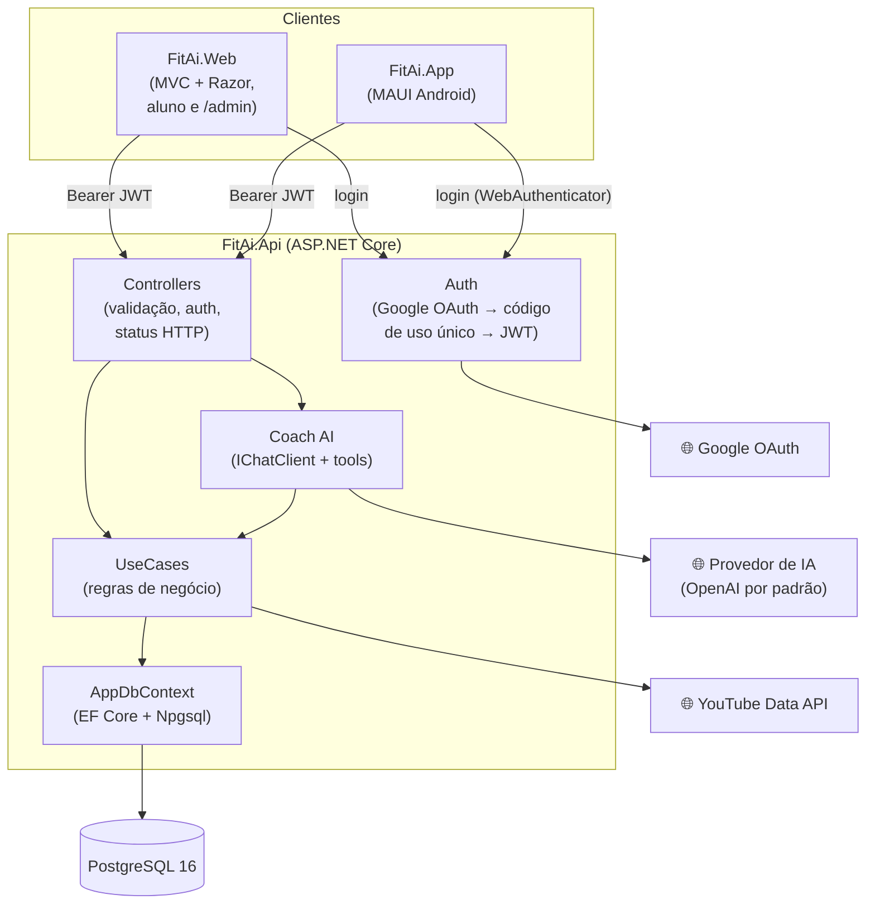

# FIT.AI — Plataforma de Treinos (.NET 10)


> **FIT.AI** é o nome que a pessoa lê — telas, logo, Figma. A solution se chama **`FitAi`**.
>
> 🚧 **Em construção.** Esta branch reescreve em .NET 10 o antigo back-end Node.js (Fastify + Prisma + Better-Auth). Veja o [estado atual](#estado-atual).

## 📋 Introdução

Entre com o Google e converse com o **Coach AI**: ele pergunta **peso**, **altura**, **idade** e **% de gordura**, depois o **objetivo**, os **dias disponíveis** e as **restrições**, e monta um **plano de treino de 7 dias** — com divisão (split), exercícios, séries, repetições, descanso e imagem de capa. No dia a dia, o aluno **inicia** e **conclui** o treino do dia e acompanha a **sequência** (🔥), a **consistência**, os **treinos feitos**, a **taxa de conclusão** e o **tempo total**.

Além do aluno, a plataforma tem **professores** e **administradores**: o professor acompanha os alunos dele e monta ou ajusta os planos de treino pela **área administrativa** (`/admin`).

A solution tem três aplicações:

| Aplicação | Projeto | Para quem |
| --- | --- | --- |
| **Backend** — API REST com controllers | `backend/FitAi.Api` | Consumida pela Web e pelo App |
| **Frontend** — ASP.NET Core MVC com Razor Views | `frontend/FitAi.Web` | Aluno (telas do Figma) e professor/admin (`/admin`) |
| **App** — .NET MAUI | `app/FitAi.App` | Aluno, no Android |

As telas do aluno são: **Login, AI Onboarding, Home, Chat da IA, Treino de Hoje, Plano de Treino, Dia do Plano, Evolução e Perfil.**

### Estado atual

| Etapa | Entrega | Estado |
| --- | --- | --- |
| Scaffold | Solution `FitAi.slnx`, projetos criados, código Node.js removido | ✅ Entregue |
| Contracts | DTOs compartilhados em `shared/FitAi.Contracts` | ✅ Entregue |
| API | Entidades, EF Core + migrations, autenticação, papéis, convites, use cases, controllers, Coach AI | 🚧 Em andamento |
| Web | Telas do aluno + área `/admin` | ⏳ Pendente |
| App | MAUI Android | ⏳ Pendente |
| Testes | xUnit (sequência, use cases) | ⏳ Pendente |

---

## 👥 Papéis e convites

| Papel | Como obtém | O que faz |
| --- | --- | --- |
| **Admin** | E-mail listado em `Auth:AdminEmails` no `appsettings` (aplicado a cada login) | Tudo: cadastra professores, vê todos os alunos e métricas, configura o Coach AI |
| **Professor** | Convidado por um admin (por e-mail) ou promovido no painel | Vê **só os alunos dele**, monta/edita planos, gera códigos de convite, liga/desliga a criação de planos pela IA por aluno |
| **Aluno** | Padrão ao entrar com o Google | Usa a Web e o App: Coach AI, treinos, evolução, perfil |

O aluno se vincula a um professor de duas formas:

1. **Convite por e-mail** — o professor cadastra o e-mail do aluno; no primeiro login com o Google usando esse e-mail, o aluno já entra vinculado.
2. **Código de convite** — o professor gera um código curto (ex.: `FIT-7K2Q`), com validade e limite de usos opcionais, que pode ser desativado a qualquer momento. O aluno digita o código no onboarding ou no Perfil.

Quem entra sem convite vira aluno sem professor e pode informar um código depois. Os **planos de treino** podem ser montados pelo **professor** (no painel) ou pelo **Coach AI** (no chat); o professor vê e ajusta os planos gerados pela IA.

---

## 🏗️ Arquitetura do Sistema



Camadas em uma direção só: **Controllers → Use Cases → EF Core**. O controller valida a entrada e a autenticação, chama um use case e devolve o status HTTP. O use case concentra a regra de negócio, fala direto com o `AppDbContext` e devolve DTOs de `FitAi.Contracts` — nunca a entidade do banco. Erros de negócio são exceções customizadas, traduzidas em `{ error, code }` com o status HTTP correspondente.

### Autenticação

1. O cliente (Web ou App) abre `GET /auth/google/login?redirectUri=...` na API.
2. A API faz o login com o Google e redireciona para `redirectUri?code=...` com um **código de uso único** (curta duração). Só são aceitos os `redirectUri` listados em `Auth:AllowedRedirectUris` (ex.: o callback da Web e `fitai://auth` do App).
3. O cliente troca o código por um **JWT** em `POST /auth/token`.
4. Todas as chamadas seguintes usam `Authorization: Bearer <token>`. O papel e o bloqueio são lidos do banco a cada requisição, então promover ou bloquear alguém vale na hora.

Em desenvolvimento, `POST /auth/dev-login` permite entrar só com um e-mail, sem Google (`Auth:EnableDevLogin`).

### Coach AI com provedor configurável

O chat usa `Microsoft.Extensions.AI` (`IChatClient` + tools). O provedor padrão é a **OpenAI**, mas qualquer provedor listado em `Ai:Providers` pode ser escolhido — pelo `appsettings` ou pelo admin no painel (`/admin`):

| Tipo | Exemplos |
| --- | --- |
| `OpenAI` (endpoint compatível com OpenAI) | OpenAI, Google Gemini, Ollama, OpenRouter, Groq |
| `AzureOpenAI` | Azure OpenAI |

As chaves ficam só na configuração (User Secrets / variáveis de ambiente); no painel o admin escolhe o provedor, o modelo, o prompt do sistema e as imagens de capa. As tools do chat são: `getUserTrainData`, `updateUserTrainData`, `getWorkoutPlans`, `createWorkoutPlan` e `searchExerciseVideos` — sempre com o `userId` do usuário autenticado, nunca vindo do modelo.

### Rotas da API (planejadas)

| Método | Rota | Tela |
| --- | --- | --- |
| `GET` | `/auth/google/login` · `/auth/google/callback` | Login |
| `POST` | `/auth/token` · `/auth/dev-login` | Login |
| `GET` | `/auth/me` | Todas |
| `GET` | `/home/{date}` | Home |
| `GET` · `PUT` | `/me` | Onboarding / Perfil |
| `POST` | `/me/teacher` | Informar código de convite |
| `GET` | `/stats?from=&to=` | Evolução |
| `GET` · `POST` | `/workout-plans` | Plano de Treino |
| `GET` | `/workout-plans/{planId}` | Plano de Treino |
| `GET` | `/workout-plans/{planId}/days/{dayId}` | Treino de Hoje / Dia do Plano |
| `POST` | `/workout-plans/{planId}/days/{dayId}/sessions` | Iniciar treino |
| `PATCH` | `/workout-plans/{planId}/days/{dayId}/sessions/{sessionId}` | Marcar como concluído |
| `POST` | `/coach/chat` | Chat / Onboarding |
| `GET` | `/admin/dashboard` | Painel |
| `GET` · `PATCH` | `/admin/users` · `/admin/users/{id}` | Alunos e professores |
| `POST` · `PUT` · `DELETE` | `/admin/users/{id}/workout-plans` · `/admin/workout-plans/{id}` | Planos dos alunos |
| `GET` · `POST` · `DELETE` | `/admin/invites` · `/admin/invite-codes` | Convites |
| `GET` · `PUT` | `/admin/ai-settings` | Configurações do Coach AI |

### Modelo de dados

Peso em **gramas**, altura em **centímetros**, gordura corporal em **inteiro de 0 a 100**, duração e descanso em **segundos**. Datas com fuso (`timestamptz`). Excluir um plano apaga dias, exercícios e sessões em cascata.

| Tabela | O que armazena |
| --- | --- |
| `Users` | Nome, e-mail, foto, papel, professor, bloqueado, IA pode criar planos, peso, altura, idade, % de gordura |
| `ExternalLogins` | Vínculo com o login do Google |
| `WorkoutPlans` | Aluno, nome, objetivo, capa, ativo (um por aluno), origem (IA ou professor) |
| `WorkoutDays` | Plano, nome, dia da semana, descanso, duração estimada, capa |
| `WorkoutExercises` | Dia, ordem, nome, séries, repetições, descanso |
| `WorkoutSessions` | Dia, início, conclusão (vazia = só iniciada) |
| `EmailInvites` | Convites por e-mail (aluno ou professor) |
| `InviteCodes` | Códigos de convite do professor (validade, limite de usos, ativo) |
| `AuthCodes` | Códigos de uso único do login |
| `AppSettings` | Configurações editáveis no painel (Coach AI) |

---

## 🎯 Sequência e consistência

A **sequência** (🔥) conta, a partir da data pedida para trás, os dias seguidos em que o plano ativo foi cumprido. **Dia de descanso conta** mesmo sem sessão. Dia da semana que não está no plano é pulado. **Hoje não quebra a sequência:** se o treino de hoje já foi concluído, conta; se não, é ignorado. A contagem para no primeiro dia de treino anterior sem sessão concluída, ou na data de criação do plano.

A **consistência** agrupa as sessões pela data de início (UTC). Na **Home**, vem a semana inteira (domingo a sábado); em **Evolução**, só os dias com sessão dentro de `from`–`to`. **Taxa de conclusão** = sessões concluídas ÷ total de sessões. **Tempo total** = soma de (conclusão − início) das sessões concluídas, em segundos. O treino de um dia só pode ser iniciado uma vez **por data** (409), e só em plano ativo (422).

---

## ⚙️ Como Executar

### 1. Pré-requisitos

- [.NET 10 SDK](https://dotnet.microsoft.com/download/dotnet/10.0)
- Docker (para o PostgreSQL) ou um PostgreSQL 16 local
- Para o App: workload MAUI (`dotnet workload install maui-android`) e o Android SDK (Visual Studio 2022+/Rider já instalam)
- Ferramenta do EF Core: `dotnet tool install --global dotnet-ef`

### 2. Banco

```bash
docker compose up -d
```

### 3. Segredos

As chaves ficam em [User Secrets](https://learn.microsoft.com/aspnet/core/security/app-secrets), nunca no `appsettings.json`:

```bash
cd backend/FitAi.Api
dotnet user-secrets set "Auth:JwtSecret" "<string aleatória com 32+ caracteres>"
dotnet user-secrets set "Auth:Google:ClientId" "<client id>"
dotnet user-secrets set "Auth:Google:ClientSecret" "<client secret>"
dotnet user-secrets set "Ai:Providers:OpenAI:ApiKey" "<chave da OpenAI>"
dotnet user-secrets set "YouTube:ApiKey" "<chave do YouTube Data API>"   # opcional
```

E defina quem é admin em `Auth:AdminEmails` no `appsettings.Development.json`.

### 4. Rodar

```bash
dotnet ef database update --project backend/FitAi.Api   # aplica as migrations
dotnet run --project backend/FitAi.Api                   # API
dotnet run --project frontend/FitAi.Web                  # Web
```

O App é executado pelo Visual Studio ou Rider num emulador ou aparelho Android. No emulador, a API local fica em `http://10.0.2.2:<porta>`.

### 5. Testes

```bash
dotnet test tests/FitAi.Api.Tests
```

---

## 📂 Estrutura de Pastas

```
FitAi.slnx
├── backend/FitAi.Api/          # API REST (controllers, use cases, EF Core, auth, Coach AI)
├── frontend/FitAi.Web/         # MVC + Razor (telas do aluno e área /admin)
├── app/FitAi.App/              # .NET MAUI (Android)
├── shared/FitAi.Contracts/     # DTOs de request/response e enums compartilhados
├── tests/FitAi.Api.Tests/      # xUnit
├── docker-compose.yml          # PostgreSQL 16
├── docs/                       # template de prompt para novas rotas
└── tasks/                      # especificações originais das funcionalidades
```

---

## 📚 Documentação

- [`CLAUDE.md`](CLAUDE.md) e [`.claude/rules/`](.claude/rules/): convenções do projeto
- [`tasks/`](tasks/): especificação de cada funcionalidade (escritas na versão Node.js; as regras de negócio valem para a versão .NET)
- `/docs` (com a API rodando): referência interativa da API (Scalar)

---

## 📄 Licença e Uso

Projeto desenvolvido no bootcamp do Full Stack Club. Nenhum arquivo `LICENSE` foi adicionado ainda.
